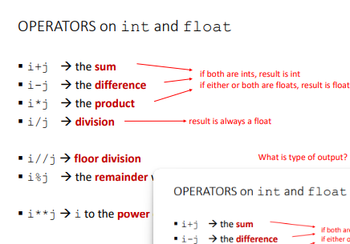

# NOTAS

### INTRODUCCION

- Aprender ciencias de computacion
    - conceptos <> lecturas y examenes
    - skills <> practicar
    - resolucion de probelmas <> conjunto de problemas por tema

- Tipos de conocimiento
    - Declarativa es un hecho | afirmacion
    - imperativa es una receta "como"
    - **programacion es escribir recetas para generar hecho**
    - Ejemplo : x*x=16 => cuanto vale x
     
- Algoritmo
    - Entrada y salida
    - sequencias de pasos simples
    - flujo de control con cada paso especificado
    - determinar cuando detener el flujo
    * Ejemplo : 
        Algoritmos son recetas y las recetas son algoritmos
        Honear un queque
        1. Combinar ingredientes
        2. añadir huevos
        3. vertir mezcla
        4. Hornear a 350 F por 5 min
        5. incrustar palillo en queque
            5.1  si no sale limpio , repetir paso 4 y 5
            5.2  de lo contrario ,sacar del horno
        6. Comer

- Almacenamiento de programas de computadora
    - secuencias se almacena dentro de las computadora
    - construida desde predefinida conjunto instrucciones primitivas
        - logica aritmentica , simples pruebas , datos en moviento
    - interprete <> ejecuta cada instruccion en orden
    
    
    * la memoria almacena las variables , la unidad arimetica realiza las operaciones, control unidad realiza las asignaciones 
    
- Primitivos
    - turing demostro que con 6 operaciones se puede realizar cualquier calculo: left,right,print,scan,erase,no op
    - lenguajes de programacion tiene mas primitivos

- Aspectos de lenguajes de programacion
    - Primitivos:   
        - forma mas basica como en un idioma son las palabras
        - numbers , strings y operaciones simples
    - Syntaxis
        - en un idioma unir solo palabras como sustantivos no tiene signficado pero al conjugarlo si cuenta con significado
        - en un lenguaje de programacion pasa algo similar
            "hi"5 -> no valido
            "hi"*5 -> valido
    - Sematica
        - hace referencia a que puede conjugarlo pero es incorrecto
        como error en el lenguaje de conjugar plurar con singular 
        -  "hi" + 5 -> error
        - un idioma puede tener una frase varios significados
        - en un programa solo un significado (no es necesariamente el significado qeu pretendia)

- Donde nos equivocamos? 
    - errores de **Syntaxis** =>  "hi"5 
    - errores semanticos estaticos =>  "hi"+5 
        cosas que pasan en la compilacion
    - diferente comportamiento al que el programador pretendia
        - programas crashea,se detiene de la nada , etc

#### PYTHON PROGRAMAS

-  Un programa una secuencia de comandos (declaraciones)
-  comanods son interpredatos
- **2 formas de ejecutar un programa es directamente en shell(consola) o almacena un archivo que sera leido y evaluado**


- ENTORNO DE PROGRAMACION
    
    - 1 Editor de codigo
    - 2 Shell/consola

- Objectos
    - Programa manipulan objectos
    - tienen varios tipos en los programas
        - 30 : numerico
        - 'Techbway' : secuencia de caracteres(string)
    - Objectos Scalar (no se pueden dividir)    
        Numericos, booleanos( true , false)
        
    - Objectos no scalar
        - Listas , diccionarios , secuencia de caracteres
    
- Ejecuta en consola
    - type <> identifica los tipos de objectos
    - casting <> convierte un tipo a otro
        float(3)=> convierte int to float 3.0
        round

- Expresiones
    Combina objectos para formar una expresion
    Syntaxis simple para una expresion
        <object> <operator> <object>

- Operaciones
    

    - ** Parentesis es parecido a matematica **
    - se opera de izquierda a derecha

- Variables
    
    - una variable esta vinculada a solo un valor en el momento dado
    - puede estar vinculado a una expresion 
- Vinculando de Variables a valores
    - paso 1 : calcular el valor en el lado derecho (el valor)
    - paso 2 : Almacenar para el lado izquierdo(la variable)
    -  pi (variable) = 355/133(value)
- Recomendaciones para variables:
    - Dar nombres que describan el valor
    - codigo facil de leer
    
    - el mejor codigo es el que describe los valores en variables
- Como se ejecutan ?
    - las lineas de codigo se ejecutan en orden una tras otra
    -[python-tuttor](https://pythontutor.com/visualize.html#mode=display)
    - Ejemplo: 
    meters = 100
    feet = 3.2808 * meters
    meters = 200
- Resumen :
    - Objectos en memoria tienen tipos
    - tipos nos indican que operaciones puedo realizar con los objectos
    - la asignacion es con el signo =
    - las variables vinculan nombres a objectos
    - Programas realizan los que se indican de manera ordenada,declarar buenos nombres a las variables mejoran el codigo

=============== 
# RESUMEN GENERADO POR IA 


## 1. Conceptos Básicos de Computación
- **Ciencias de la Computación**: Se aprende tanto **conceptos teóricos** como **habilidades prácticas**. La **resolución de problemas** se aprende a través de la práctica, con ejercicios que exploran distintos temas.
  
- **Tipos de Conocimiento**:
  - **Declarativa**: Hechos o afirmaciones (ej. "x * x = 16" indica que el valor de x es 4).
  - **Imperativa**: Instrucciones para lograr un objetivo (ej. recetas o algoritmos).

- **Algoritmos**:
  Un algoritmo es un conjunto de pasos bien definidos para resolver un problema. Tiene:
  - **Entrada**: Datos iniciales.
  - **Salida**: Resultado esperado.
  - **Secuencia de pasos**: Instrucciones detalladas.
  - **Control de flujo**: Cómo se manejan las decisiones (ej. "si... entonces").
  - **Condiciones de terminación**: Especifican cuándo detener el algoritmo.

  **Ejemplo de algoritmo** (hacer un pastel):
  1. Combina ingredientes.
  2. Añadir huevos.
  3. Verter mezcla.
  4. Hornear a 350°F por 5 minutos.
  5. Insertar un palillo para comprobar.
    - Si el palillo sale limpio, sacarlo del horno.
    - Si no, repetir pasos 4 y 5.
  6. Comer.

## 2. Lenguajes de Programación
- **Primitivos**: Son las operaciones básicas necesarias para realizar cálculos (ej. sumar, restar, mover datos). Alan Turing mostró que con 6 operaciones simples es posible hacer cualquier cálculo.
  
- **Aspectos de Lenguajes de Programación**:
  - **Primitivos**: Palabras más básicas del lenguaje (ej. números, cadenas de texto).
  - **Sintaxis**: Reglas de cómo combinar los elementos para formar instrucciones válidas.
  - **Semántica**: Significado de las instrucciones. El error semántico ocurre cuando la sintaxis es correcta, pero el resultado no es el esperado.

  Ejemplos de errores:
  - **Sintaxis**: `"hi"5` → Error.
  - **Semántico**: `"hi" + 5` → Error, porque no puedes sumar un texto y un número.

## 3. Conceptos Específicos de Python
- **Programa**: Secuencia de instrucciones que el intérprete de Python ejecuta.
- **Modo de ejecución**: 
  - Directamente en la consola (Shell).
  - Almacenado en un archivo y ejecutado como un script.
  
- **Entorno de Programación**:
  - **Editor de código**: Herramienta donde escribes tu código.
  - **Consola (Shell)**: Donde ejecutas tu código y ves los resultados.

## 4. Objetos en Python
- **Objetos Escalares**: No se pueden dividir en partes más pequeñas. Ejemplos: números (enteros, flotantes) y valores booleanos (True, False).
- **Objetos No Escalares**: Se pueden dividir en partes más pequeñas. Ejemplos: listas, diccionarios, cadenas de texto.

- **Tipos de Objetos y Operaciones**:
  - `type()` para identificar el tipo de un objeto.
  - **Casting**: Convertir un tipo de objeto a otro (ej. `float(3)` convierte 3 en 3.0).
  
- **Expresiones y Operadores**:
  Las expresiones combinan objetos y operadores para realizar cálculos.
  
- **Variables**:
  Las variables vinculan un nombre a un valor en memoria. El valor de una variable puede ser el resultado de una expresión.
  
  **Ejemplo**:
  ```python
  pi = 355 / 133
