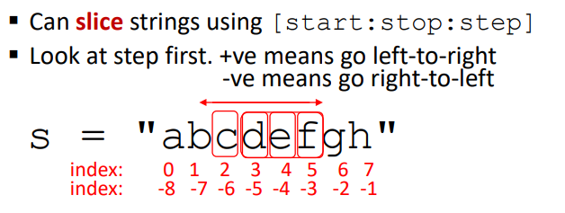
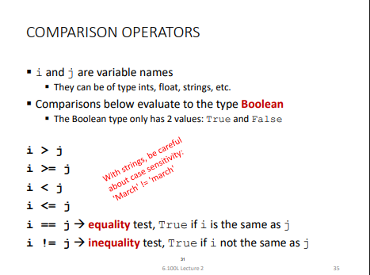
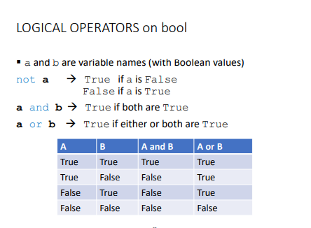

# NOTAS

### STRINGS, I/O , RAMIFICACIONES

- strings
    - conjunto de  secuencia de caracteres , pueden ser cualquiera caracterer
        minuscula , mayuscula , numerico ,etc va entre comillas (type)
    - operaciones : concatenamiento    
    - len <> cantidad de caracteres
    - la forma de obtener un caracter es buscando el indice 
        string[0]
    
    - generar subcadenas [0,3]
        s="abcdefgh" => s[3:6]
    - **immutabilidad** de strings
        - no se puede actualizar un valor en especifico
        - para modificar deberiamos crear un nuevo objecto
        - ejemplo s[0]='b'

- input / output
    - output:
        - es para mostrar datos en consola
        - comando print()
        - poner dentro de la funcion el objecto a imprimir
        - ejemplo

    - input :
        - usa el metodo print para vincular la entrada con una variable
        - este valor sera un **string**
        - ejemplo


- ejemplos:
    - ingresando cualquier texto
    - algoritmo de calculo
- F strings
    - formas de combinar las impresiones
    - ejemplos

- Comparacion de operaciones
    
    
    - ejemplos

- que son los booleanos
    - cuando algo segun el valor

- Ramificacion en python

 ```
    if <condition>
        <code>
        <code>
    <continua el programa>
 ```
  - condition puede ser verdadero o false
  - **la identacion en python es importante**

 ```
  if <condition>
        <code>
        <code>
  else
        <code>
        <code>
    <continua el programa>
 ```

  ```
  if <condition>
        <code>
        <code>
  elif
        <code>
        <code>
  elif
        <code>
        <code>
  else
        <code>
        <code>
    <continua el programa>
 ```

- Ejemplo

- Resumen
    - string
        - secuencia de caracteres, el primer indice es cero
        -se puede segmentar
    - input
        - comando input
        - captura como string
    - Output
        - se realiza con comando print
        - se visualiza en la consola
    - Ramificación.
    " Los programas ejecutan bloques de código cuando las condiciones son verdaderas.
    " En una estructura if-elif-elif ..., se ejecutará la primera condición que sea verdadera.
    - La identacion es importante en Python.