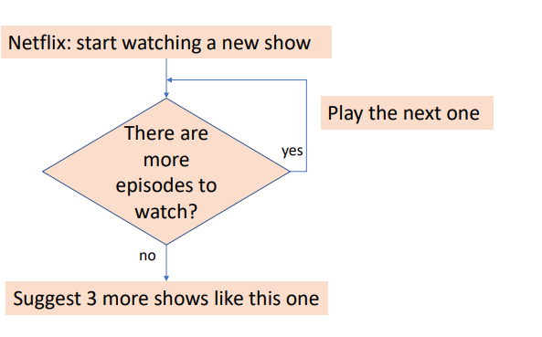
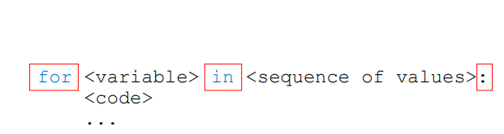

# NOTAS

### BUCLES



- While
    - evaluacion de una condicion
    - mientras sea verdadero se ejecutara
    - en cada momento vuelvo a revisar la condicion
    - si es falso no realizara la ejecucion


- For
    - Estructura:
      
     
    - en cada momento momento toma un valor de la secuencia
    - en primer momento el primer valor ,asi sucesivamente hasta correr todos los valores
    -  un comun forma de implementar es con la funcion range
    ```
        for <variable> in range(algun_numerico):
            <code>
            <code>

        for n in range(5):
            print(n)
    ```
    - ejemplo : for.py :
        suma , adivina el numero
    - funcion range como usarla?
    ```
        range(start,stop,step)
    ```
    - ejemplo : range.py
    


