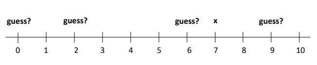
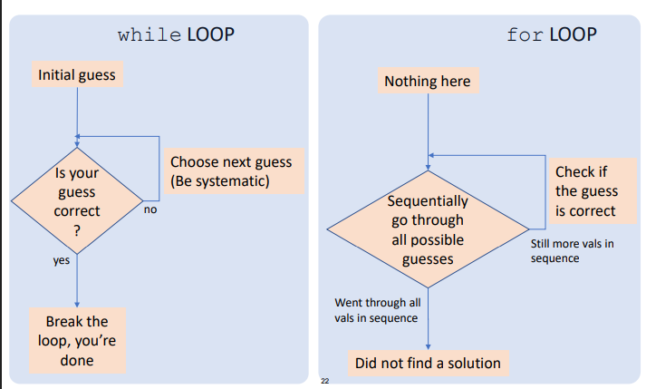

# NOTAS

### BUCLES

- break
    - detiene un bucle

- continue
    - detiene la secuencia actual pero no el bucle

- string en loops
    - ejemplo

- diferencia entre for y while 

## TODO LO QUE NECESITAMOS PARA HACER UN ALGORITMO
