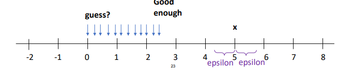

# NOTAS

# FLOTANTES Y METODO DE APROXIMACION

- operaciones con flotantes introduce un pequeño error

- depende de la computadora del hardware no del lenguaje de programacion

- todo okay con la parte entera pero que pasa con la parte decimal(float)

# NUNCA USES == CON FLOTANTES