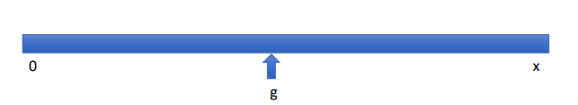
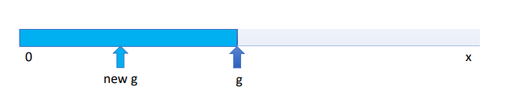
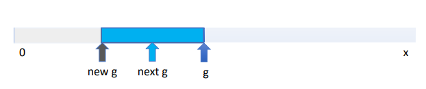
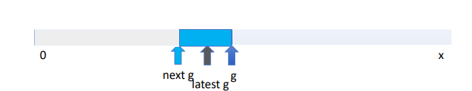

# NOTAS

# BUSQUEDA DE BISECCION | BINARIA

- un metodo que permite encontrar soluciones acotando espacios
- el proceso se va acotando de forma iterativa reduciendo de N a N/2
- en comparacion de hacer un calculo exhaustivo
- quiere decir que 
 ```
    primero=> n/2
    segundo=> n/4
    n=> n/2^n
    quiere decir que va creciendo de forma logartimica
```
- escogemos el numero central 

- determinamos si el numero a buscar es mayor o menor al central y encontramos luego nuevo punto medio

- volvemos a realizar la pregunta y nuevo valor central

- realizamos nuevamente el proceso

- existe un metodo mas eficiente => newton raphson 

### CONCLUSION

-  Para muchos problemas no se puede encontrar metodos exactos para ellos las aproximaciones
- importancia de los decimales en binarios
- La búsqueda binaria (bisection search) es muy rápida
- Newton-Raphson es otro método muy inteligente y rápido para encontrar raíces (soluciones) de funciones matemáticas 
